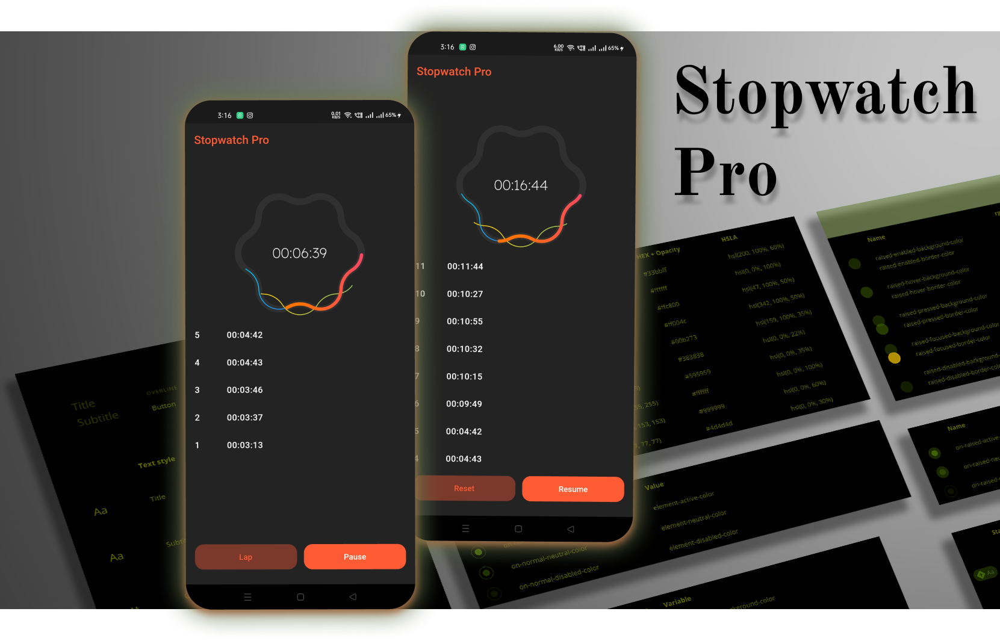

# Stopwatch Pro
- See [LICENSE](/LICENSE)

Hybrid Stopwatch and Timer is a simple, easy and accurate app for android that will help you to measure the time of any situation, like sports, cooking, games, education, etc.

## Stopwatch mode
Start and stop the stopwatch pressing the button on the center of the screen, you can see the elapsed time on the top digital display and on the analog view like and old school stopwatch. To record a lap press the left button, a lap hand will be added to the analog view, and to reset press the right button. The buttons are placed to only use one hand.

## Laps List:
You can access the lap list with the dropdown menu on the top or just sliding your finger to the left. On this lap list you can choose to see the lap time or total time. Lap List can be saved to the sd card, shared to social media or be emailed.

## Countdown timer mode:
Set the timer fast and easy, dragging the second and minute hands, or use the classic input method pressing the left button. To reset press the right button, one tap will restore the last used time, long press will reset the timer to 0.

----
----
## Getting Started

This project is a starting point for a Flutter application.

A few resources to get you started if this is your first Flutter project:

- [Lab: Write your first Flutter app](https://flutter.dev/docs/get-started/codelab)
- [Cookbook: Useful Flutter samples](https://flutter.dev/docs/cookbook)

For help getting started with Flutter, view our
[online documentation](https://flutter.dev/docs), which offers tutorials,
samples, guidance on mobile development, and a full API reference.
